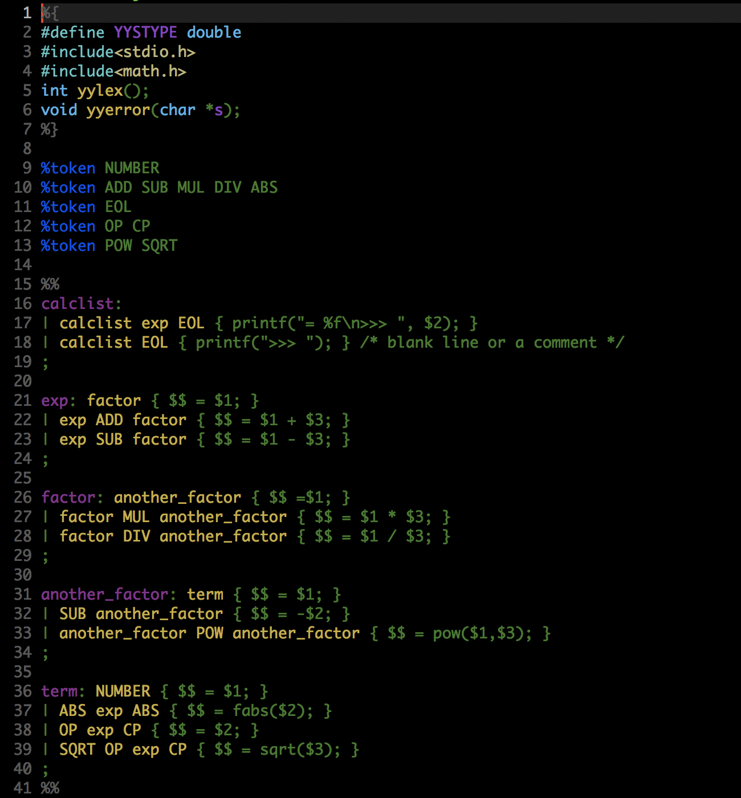

### What's this?
It's a mode for bison files that provide better syntax highlight than bison-mode.el

## Installation
Then put bison.el to your load-path.

The load-path is usually ~/elisp/.

It's set in your ~/.emacs like this:

```Elisp
(add-to-list 'load-path (expand-file-name "~/elisp"))

(require 'bison)

(add-to-list 'auto-mode-alist '("\\.y$" . bison-mode))
(autoload 'bison-mode "bison")
```
